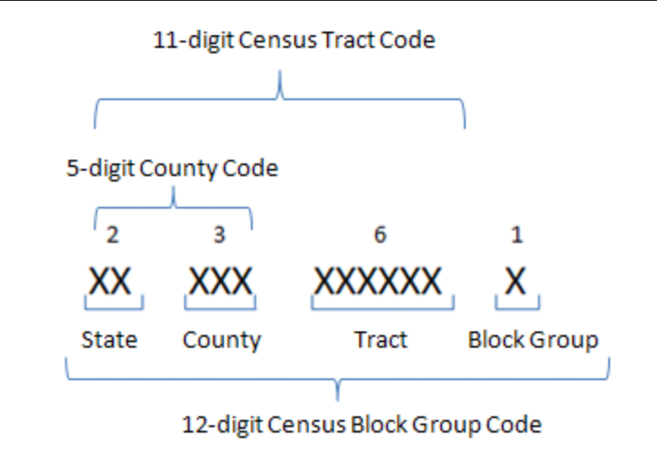
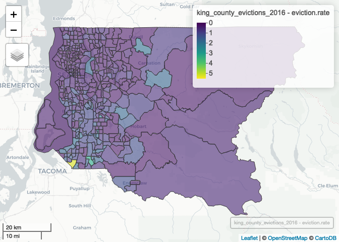

Introduction to Geospatial Visualization
================
[Marley Buchman](https://github.com/buchmayne)
2019-08-24

In preparation for craggy 2019, here is a very brief introduction to
simple ways to visualize spatial data. This notebook will introduce some
R packages and functions to visualize spatial data. The notebook will
use 6 total packages, 3 of which are in the tidyverse. The three tidy
functions will be used for routine data wrangling. The 3 other packages
will be used to work with the spatial data. The first package is `sf`
and it is my personal preferred package to use when working with spatial
data. The `sf` package contains all of the spatial operation functions
needed for routine spatial analysis, and the syntax meshes well with the
tidyverse. The `sf` package introduces the `sf` type, and you can think
of the `sf` type as a spatial data frame. It is like a normal vanilla
data frame but there is an additional “geometry” column that is of list
column type, and that column contains all of the spatial information.

The next package we will be using is `mapview` and it provides
functionality to create interactive web maps. If you need to quickly
visualize your spatial data `mapview` is a great first tool to use.

The last package is the `tigris` package and this allows us to download
census spatial boundaries from the census. For this data set we will be
looking at data provided at the census tract geography. The data is
provided as a regular csv, so we will need a way to convert that data to
a `sf` object. To do this we will download the Washington census tract
shapes and join them to our data. Let’s begin

``` r
## the first three packages are all loaded in library(tidyverse) as well
library(dplyr)
library(ggplot2)
library(stringr)

# spatial packages
library(sf)  # working with spatial data
library(mapview)  # quick and easy geospatial visualizations
library(tigris)  # downloading geospatial data from the census

# data package
library(craggy2019)
```

To start I will read the evictions data into memory. The data is stored
in a csv so I will use `read.csv()` to read the data and assign the data
frame to evictions. After reading the data into memory I will print the
first five rows.

``` r
evictions <- read.csv(
  system.file("extdata", "evictions.csv", package = "craggy2019"), 
  stringsAsFactors = FALSE
)

head(evictions, n = 5)
```

    ##         GEOID year name          parent.location population poverty.rate
    ## 1 53001950100 2000 9501 Adams County, Washington       2547        14.83
    ## 2 53001950100 2001 9501 Adams County, Washington       2547        14.83
    ## 3 53001950100 2002 9501 Adams County, Washington       2547        14.83
    ## 4 53001950100 2003 9501 Adams County, Washington       2547        14.83
    ## 5 53001950100 2004 9501 Adams County, Washington       2547        14.83
    ##   renter.occupied.households pct.renter.occupied median.gross.rent
    ## 1                        278               27.02               409
    ## 2                        280               27.02               409
    ## 3                        281               27.02               409
    ## 4                        283               27.02               409
    ## 5                        284               27.02               409
    ##   median.household.income median.property.value rent.burden pct.white
    ## 1                   36360                 79800          26     94.58
    ## 2                   36360                 79800          26     94.58
    ## 3                   36360                 79800          26     94.58
    ## 4                   36360                 79800          26     94.58
    ## 5                   36360                 79800          26     94.58
    ##   pct.af.am pct.hispanic pct.am.ind pct.asian pct.nh.pi pct.multiple
    ## 1      0.24         2.71       0.55      0.51         0         1.37
    ## 2      0.24         2.71       0.55      0.51         0         1.37
    ## 3      0.24         2.71       0.55      0.51         0         1.37
    ## 4      0.24         2.71       0.55      0.51         0         1.37
    ## 5      0.24         2.71       0.55      0.51         0         1.37
    ##   pct.other eviction.filings evictions eviction.rate eviction.filing.rate
    ## 1      0.04                3         0          0.00                 1.08
    ## 2      0.04                7         2          0.72                 2.50
    ## 3      0.04                1         0          0.00                 0.36
    ## 4      0.04                6         6          2.12                 2.12
    ## 5      0.04                4         4          1.41                 1.41
    ##   low.flag imputed subbed
    ## 1        0       0      0
    ## 2        0       0      0
    ## 3        1       0      0
    ## 4        0       0      0
    ## 5        0       0      0

The data doesn’t have any spatial information other than a “GEOID” which
is also referred to as a “fips code”. Fips codes are a way of
designating a spatial hierarchy to different geographies in the U.S. The
number of digits in the fips code (most commonly seen with the column
name “GEOID”) corresponds to a specific census geographic specification.



The image above shows the digit designations for states, counties,
tracts, and block groups. Since our data is at the census tract level we
need to make sure that all of the GEOIDs have 11 digits. Since the
GEOIDs are numeric, when loading data with fips codes it is common that
the data will be read into memory as numeric. This is to be expected but
can cause issues since the fips codes are categorical in nature. For
example, the state fips code of California is “06” but the leading 0 is
often dropped when loaded as a numeric. For this reason, it is usually
good to convert the GEOID to character and see if all of the
observations have the right amount of characters. We will do that below.

``` r
evictions <- dplyr::mutate(evictions, GEOID = as.character(GEOID))

dplyr::count(evictions, stringr::str_length(GEOID))
```

    ## # A tibble: 1 x 2
    ##   `stringr::str_length(GEOID)`     n
    ##                          <int> <int>
    ## 1                           11 24786

Now that we have confirmed that all of the GEOIDs are of the right
length, it is time to get the shapes for each census tract. To do this
we will use the aforementioned `tigris` package. We will call the
`tracts()` function from the tigris package and pass in “WA” as the
state. The output of this call will be a spatial data frame. This data
type comes from the `sp` package and I will transform this into the `sf`
type using the function `st_as_sf()`. This is personal preference but
the `sf` package is newer and I find it much easier to use than `sp`.

``` r
tracts <- tigris::tracts(state = "WA")

tracts <- sf::st_as_sf(tracts)
```

Now that the census tract shapes have been assigned to the object
“tracts”, I will join the evictions data to the tracts data.

``` r
evictions <- dplyr::inner_join(tracts, evictions)
```

Since the data is a time series for each tract, we will filter the data
on the most recent year in the sample. When visualizing spatial data is
difficult to also include a temporal dimension. You can of course
visualize change over time but for this example we will just focus on
the 2016 data.

``` r
evictions_2016 <- dplyr::filter(evictions, year == "2016")
```

The evictions data for the entire state of Washington is included and we
are mostly interested in King County. I will filter on King County for
this purpose.

``` r
king_county_evictions_2016 <- dplyr::filter(evictions_2016, parent.location == "King County, Washington")
```

The first visualization technique we will use is ggplot. ggplot supports
`sf` objects and they can be plotted using the `geom_sf()` function. The
rest of the code below is from the standard ggplot library, I will
relabel the legend and plot title. Additionally, I will use the void
theme.

``` r
ggplot(data = king_county_evictions_2016) +
  geom_sf(aes(fill = eviction.rate)) +
  labs(title = "King County 2016", 
       fill = "Eviction Rate (%)") +
  theme_void() +
  theme(plot.title = element_text(hjust = 0.5))
```

<!-- -->

Next up is mapview. If you simply pass your `sf` object into mapview it
will create an interactive web map using openstreetmap. This will
display a choropleth of every shape in the data. A choropleth is a map
of different shapes, with the color representing a single feature of the
data. Here, we didn’t pass any columns to mapview so it just mapped all
of the data with the same color. If you click on a shape, a popup will
show the data associated with that shape.

``` r
mapview::mapview(king_county_evictions_2016)
```

<!-- -->

If you want to map a specific column of the data you can pass in the
column name quoted to the `zcol` argument.

``` r
mapview(king_county_evictions_2016, zcol = "eviction.rate")
```

<!-- -->

There are many different ways of visualizing spatial data but I hope
this can get you started.
