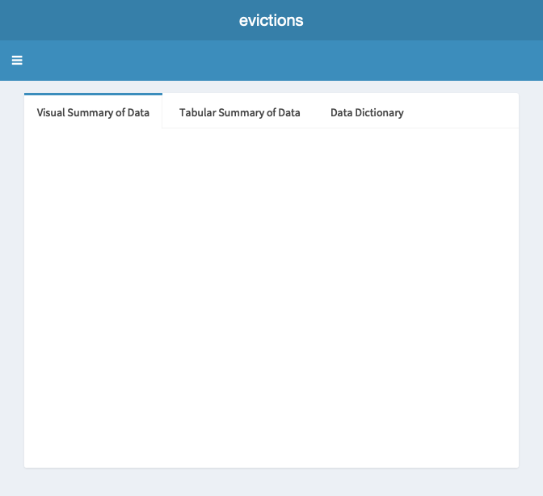
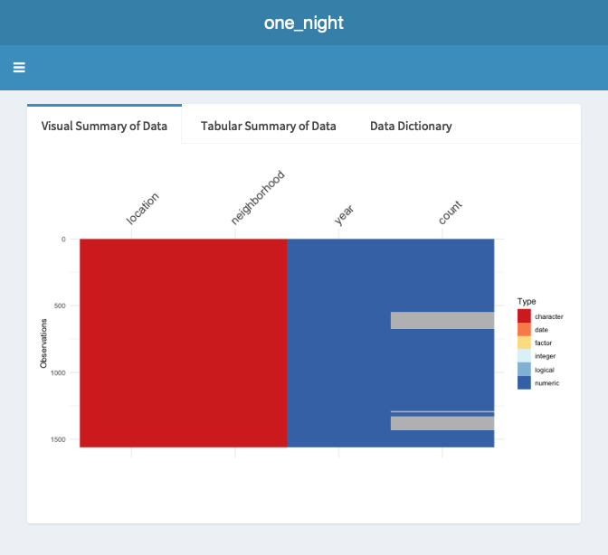

Looking at Evictions
================
[Ted Laderas](https://github.com/laderast)
2019-08-24

  - [Looking at the `evictions`
    dataset](#looking-at-the-evictions-dataset)
  - [Explore King County Zillow
    Values](#explore-king-county-zillow-values)
  - [One Night Counts](#one-night-counts)

This RMarkdown document gives you a head start by processing the data,
and lets you visualize the data using `burro`.

Run this code block to install `burro` (Data exploration app)

``` r
install.packages("remotes")
remotes::install_github("laderast/burro")

# Install from the source repository,
# if you are not running in a fork of the craggy2019 project.
# remotes::install_github("pdxrlang/craggy_2019")
```

Once installed, run from here on…

## Looking at the `evictions` dataset

``` r
evictions <- readr::read_csv(system.file("extdata", "evictions.csv", package = "craggy2019")) %>% 
  janitor::clean_names() %>% 
  mutate(low_flag = factor(low_flag), imputed=factor(imputed), subbed=factor(subbed)) %>%
  mutate(parent_location = stringr::str_replace(parent_location, pattern = ", Washington", replacement = ""))
```

    ## Parsed with column specification:
    ## cols(
    ##   .default = col_double(),
    ##   `parent-location` = col_character()
    ## )

    ## See spec(...) for full column specifications.

``` r
burro::explore_data(evictions)
```

    ## Warning in Sys.setlocale("LC_CTYPE", "Chinese"): OS reports request to set
    ## locale to "Chinese" cannot be honored

    ## 
    ## Listening on http://127.0.0.1:6180

<!-- -->

``` r
should_be_numeric <- c("estimated_number_foreclosures", "estimated_number_mortgages", "estimated_foreclosure_rate"      , "total_90_day_vacant_residential_addresses","total_residential_addresses","estimated_90_day_vacancy_rate", "total_hicost_2004_to_2006_hmda_loans",     
"total_2004_to_2006_hmda_loans",            
"estimated_hicost_loan_rate",               
"bls_unemployment_rate", "ofheo_price_change")


forclose_wa <- readr::read_csv(system.file("extdata", "forecloseWATract.csv", package = "craggy2019")) %>%
  janitor::clean_names() %>% mutate_at(should_be_numeric, ~na_if(., "#NULL!")) %>% mutate_at(should_be_numeric, ~stringr::str_replace(., "%", "")) %>% mutate_at(should_be_numeric, as.numeric) %>% select(-county, -state, -sta)
```

    ## Parsed with column specification:
    ## cols(
    ##   tractcode = col_double(),
    ##   state = col_double(),
    ##   sta = col_character(),
    ##   county = col_character(),
    ##   countyname = col_character(),
    ##   tract = col_character(),
    ##   hhuniv = col_number(),
    ##   estimated_number_foreclosures = col_character(),
    ##   estimated_number_mortgages = col_character(),
    ##   estimated_foreclosure_rate = col_character(),
    ##   total_90_day_vacant_residential_addresses = col_character(),
    ##   total_residential_addresses = col_character(),
    ##   estimated_90_day_vacancy_rate = col_character(),
    ##   total_hicost_2004_to_2006_HMDA_loans = col_number(),
    ##   total_2004_to_2006_HMDA_loans = col_character(),
    ##   estimated_hicost_loan_rate = col_character(),
    ##   bls_unemployment_rate = col_character(),
    ##   ofheo_price_change = col_character()
    ## )

    ## Warning: NAs introduced by coercion
    
    ## Warning: NAs introduced by coercion
    
    ## Warning: NAs introduced by coercion
    
    ## Warning: NAs introduced by coercion
    
    ## Warning: NAs introduced by coercion
    
    ## Warning: NAs introduced by coercion
    
    ## Warning: NAs introduced by coercion
    
    ## Warning: NAs introduced by coercion

``` r
burro::explore_data(forclose_wa)
```

    ## Warning in Sys.setlocale("LC_CTYPE", "Chinese"): OS reports request to set
    ## locale to "Chinese" cannot be honored

    ## 
    ## Listening on http://127.0.0.1:7470

<!-- -->

## Explore King County Zillow Values

This one doesn’t work - I will push fixes to `burro`.

``` r
king_zillow <- readr::read_csv(system.file("extdata", "king_zillow.csv", package = "craggy2019"))

burro::explore_data(king_zillow,outcome_var = NULL)
```

## One Night Counts

``` r
one_night <- readr::read_csv(system.file("extdata", "oneNightCount.csv", package = "craggy2019")) %>% janitor::clean_names() %>% tidyr::gather("neighborhood", "count", -year, -location)
```

    ## Parsed with column specification:
    ## cols(
    ##   Location = col_character(),
    ##   YEAR = col_double(),
    ##   SEATTLE = col_double(),
    ##   KENT = col_double(),
    ##   `NORTH END` = col_double(),
    ##   `EAST SIDE` = col_double(),
    ##   `SW KING CO` = col_double(),
    ##   `WHITE CNTR` = col_double(),
    ##   `FEDERAL WAY` = col_double(),
    ##   RENTON = col_double(),
    ##   `NIGHT OWL BUSES` = col_double(),
    ##   AUBURN = col_double(),
    ##   `VASHON ISLAND` = col_double(),
    ##   TOTAL = col_double()
    ## )

``` r
burro::explore_data(one_night)
```

    ## Warning in Sys.setlocale("LC_CTYPE", "Chinese"): OS reports request to set
    ## locale to "Chinese" cannot be honored

    ## 
    ## Listening on http://127.0.0.1:5680

<!-- -->

``` r
# Sample code for grabbing spatial data
library(tigris)
options(tigris_use_cache = TRUE)

# Grab shape files for King county at the census tract level
king_spatial <- tracts(state = "WA", county = "King")

dat <- geo_join(spatial_data = king_spatial, evictions, by = "GEOID") 
```
